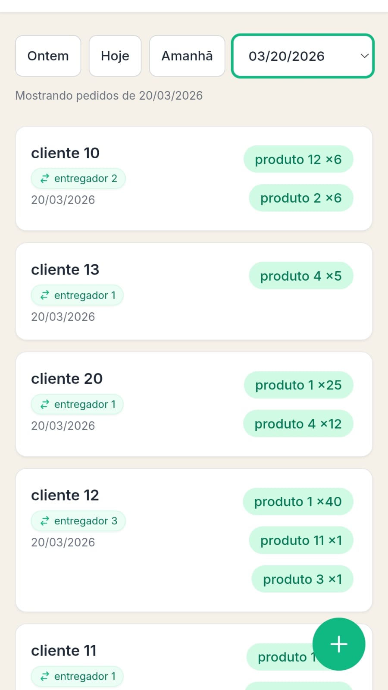
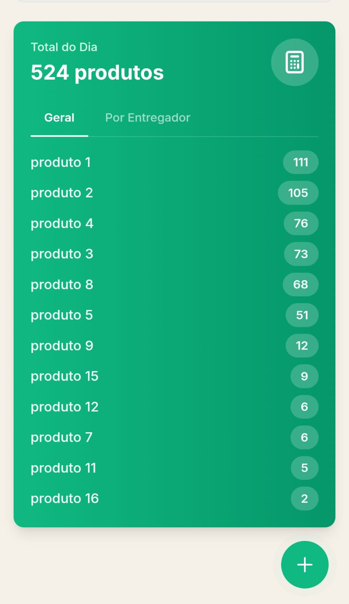
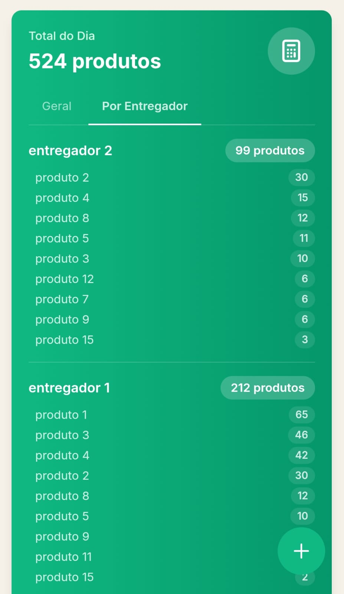
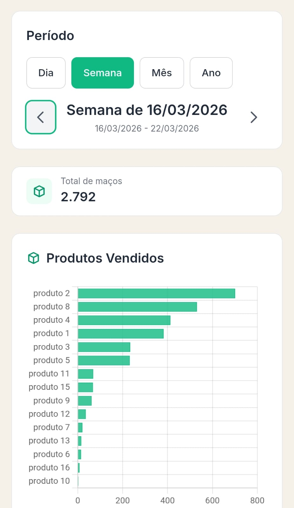
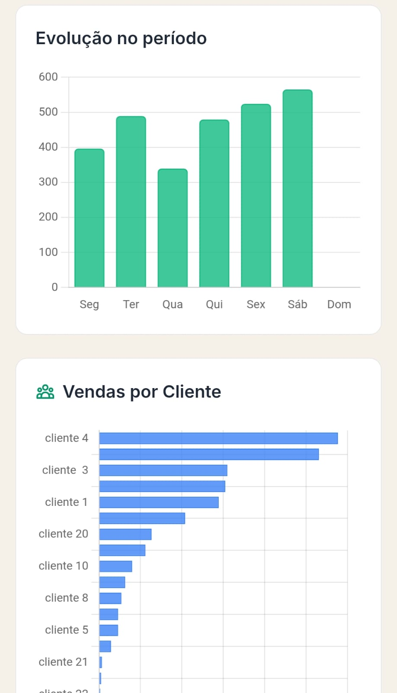

# Visão geral

## Problemas que inspiraram o início do projeto

O ponto de partida deste projeto foi uma operação real de hidroponia que utilizava o WhatsApp como principal ferramenta de gestão de pedidos. Apesar de funcional, havia complicações operacionais no dia a dia.

- No momento da colheita havia que somar todos os pedidos manualmente, o que gerava muita margem para erro humano, ainda mais considerando a correria do dia a dia. Ocasionalmente resultando em maços colhidos a mais (desperdício e prejuízo) ou a menos (problema nas entregas).
- No momento de distribuir para a entrega, reforçava novamente os problemas descritos previamente, em que tinham que calcular a distribuição das rotas manualmente.
- Falta de base de dados para análise: apesar de todo o histórico de pedidos estar no WhatsApp, não havia como garantir a persistência dos dados nem utilizá-los para análises.

Principalmente diante desses problemas, foram procuradas alternativas, muitas das tentativas falharam até que essa finalmente funcionou. Para entender melhor por que não foram contratados serviços terceirizados, veja: [Por que uma solução própria?](por-que-solucao-propria.md)

## Principais funcionalidades do App

(Primeiro vou descrever de forma funcional para depois descrever de forma técnica)

- **Lançamento de pedidos de forma simples e rápida**: Uma resistência que as pessoas têm é de preencher formulários (já que 1 pedido pode ter vários produtos) então nessa aplicação o processo de lançamento de pedidos é simplificado. Ao invés de preencher vários formulários para um pedido, o usuário lança apenas um pedido (que internamente se decompõe pela modelagem de dados)

- **Alterar e deletar pedidos**
- **Resumo diário**
    - Quantidade total de produtos: Auxilia no momento da colheita

    

    - Quantidade total de produtos por rota: Auxilia no momento de distribuir para a entrega

    

- **Histórico de vendas persistente**: Os pedidos são armazenados em Banco de dados
- **Dashboard**: Com base no banco de dados podemos criar análises como melhores e piores produtos ou clientes, identificar sazonalidade, utilizar como fonte de dados para machine learning entre outras análises.

## Funcionalidades adicionais

- **Agente de IA**: Um agente capaz de responder perguntas sobre os pedidos ou até inserir pedidos em lote, simplificando ainda mais o processo de lançamento de pedidos entre outras finalidades.

# Detalhes técnicos

## Tecnologias utilizadas

- **Backend**: Python + Flask
- **Frontend**: HTML + JavaScript + Tailwind CSS
- **Database**: PostgreSQL
- **Infraestrutura**: VPS
- **CI/CD**: GitHub Actions
- **Automação e agente de IA**: n8n
- **LLM**: Gemini
- **Autenticação**: Google OAuth2

## Banco de dados

- Banco de dados SQL PostgreSQL, hospedado localmente no servidor
- Não entrarei em muitos detalhes sobre o schema para não comprometer a segurança, porém há uma boa modelagem de dados relacional para otimização e consistência da operação.

## CI/CD

- Pipeline automatizado de build e deploy, cobrindo tanto o ambiente de desenvolvimento quanto o de produção.

## Agent

- **MCP**: Antes de criar o próprio agente, eu criei um MCP server que expõe as funcionalidades da aplicação de forma estruturada para ser consumido pelo agente de IA.
- **Agente**: Criei uma UI que envia webhooks para um agente (criado no n8n) como mensagem. podendo utilizar o MCP para responder os prompts. Utilizei uma simples memória em Window Buffer Memory, que apesar de não salvar um histórico de conversa, consegue manter o contexto das mensagens das sessões ativas.

## Camada de segurança

- **Autenticação**: SSO com Google OAuth2 + controle de acesso por roles (admin/user)
- **Proteção da aplicação**: Medidas contra os ataques mais comuns (injeção, XSS, CSRF, força bruta)
- **Proteção de rede**: A aplicação fica exposta apenas via túnel CDN, com múltiplas camadas de proteção contra bots, DDoS e tráfego malicioso
- **Banco de dados isolado**: O banco de dados roda em localhost, sem exposição à internet — o acesso é exclusivamente interno à aplicação

## Desempenho

O app é acessado principalmente pelo celular, então o desempenho de carregamento foi uma prioridade. Algumas medidas aplicadas:

- **Banco de dados em localhost**: Elimina a latência de rede na comunicação com o banco, o que gerou uma melhoria significativa nos tempos de resposta
- **Carregamento em duas fases**: Os dados são carregados em paralelo, priorizando o que é necessário para o app ficar interativo primeiro. Os pedidos (que envolvem queries mais pesadas) carregam de forma independente, sem bloquear a interface
- **Cache de assets**: JS, CSS e imagens são servidos com cache de 7 dias. A invalidação é automática a cada deploy via fingerprint baseado no commit SHA
- **CSS estático**: O Tailwind é compilado via CLI gerando apenas as classes utilizadas (~16KB), ao invés de ser carregado via CDN (~3MB com processamento em runtime)
- **Imagens otimizadas**: Assets visuais convertidos para WebP, reduzindo significativamente o tamanho dos arquivos

# Projeções

- **Automações a nível de hardware**: Projetos com sensores (Temperatura, umidade, chuva…) e microcontroladores (ESP ou Arduino) para coletar dados, interagir com regadores, bombas,
- **Emissão de notas automática**